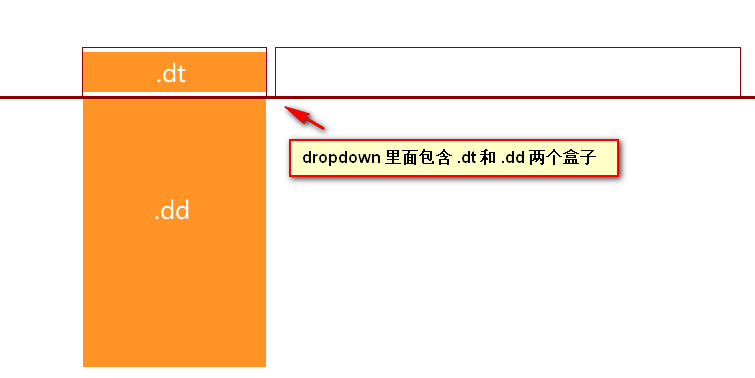
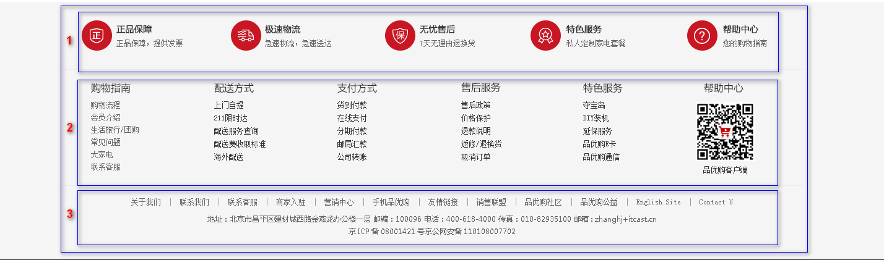
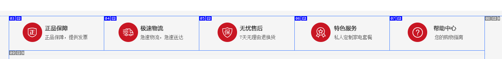
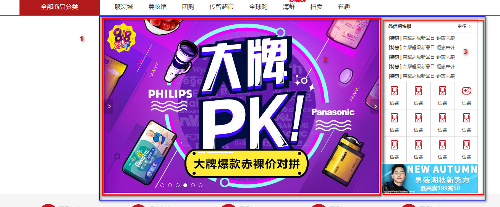
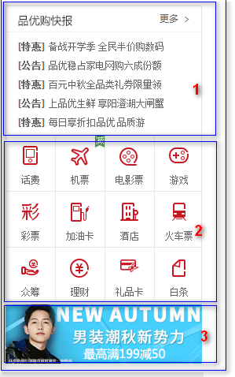
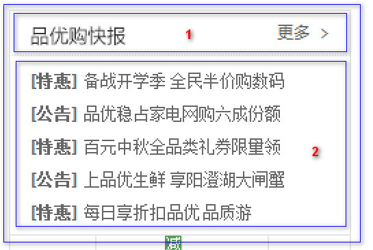
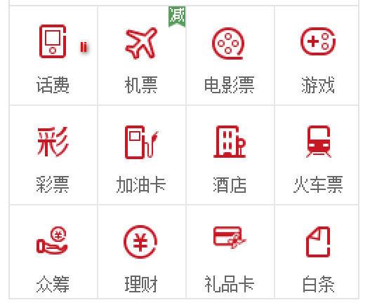
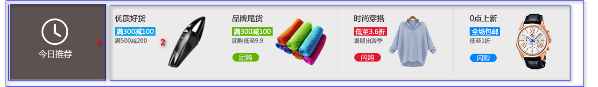

# 品优购项目(二)

目标：

* 能课堂跟上pink老师的节奏完成品优购项目

##  1. 品优购首页布局

命名集合：

| 名称             | 说明                     |
| ---------------- | ------------------------ |
| 快捷导航栏       | shortcut                 |
| 头部             | header                   |
| 标志             | logo                     |
| 购物车           | shopcar                  |
| 搜索             | search                   |
| 热点词           | hotwrods                 |
| 导航             | nav                      |
| 导航左侧         | dropdown  包含  .dd  .dt |
| 导航右侧         | navitems                 |
| 页面底部         | footer                   |
| 页面底部服务模块 | mod_service              |
| 页面底部帮助模块 | mod_help                 |
| 页面底部版权模块 | mod_copyright            |

#### 1). nav 导航栏制作

* nav 盒子通栏有高度   而且有个下边框
* 1号盒子 左侧浮动 dropdown  下拉导航  里面包含 dt   dd 
* 2号盒子右侧浮动  navitems 导航栏组

 

#### 2). footer 底部制作

* footer 页面底部盒子  通栏 给一个高度  灰色的背景
* footer 里面 首先一个 大 的版心
* 版心里面包含 1号盒子  mod_service     服务模块     module  模块的意思
* 版心里面包含 2号盒子 mod_help   帮助模块
* 版心里面包含 3号盒子 mod_copyright   版权模块 

#### 3). mod_service  服务模块制作

#### 4).  main  主体模块制作

这部分是 index 里面 专有的， 注意 需要新的样式文件  index.css  

* main 盒子 宽度 为  980像素， 距离 左边 220  给一个margin-left 就好了， 给高度就不用清除浮动。

* main 里面包含 左侧盒子 左浮动  focus  焦点图 模块 

* main 里面包含 右侧盒子 右浮动  newsflash  新闻快报模块 

  ​

#### 5). newsflash 新闻快报模块

* 1 号盒子 为 news 新闻模块  
* 2 号盒子 为lifeservice  生活服务模块
* 3 号盒子为 bargain  特价商品

#### 6). news 新闻模块

* 注意，这里我们 分为 上下两个模块，  但是 两个模块 都用div   
* 1号 盒子    news-hd   新闻头部模块  给一个 高度 和   下边框   
* 2号 盒子    news-bd   新闻主题部分   里面 包含 ul 和  li  还有 链接 

#### 7). lifeservice  生活服务模块

此地方有个小技巧，

* lifeservice  盒子 宽度为   250   但是装不开  里面的 4个 小 li 
* 可以让  lifeservice    里面的 ul  宽度为 252  就可以 装的下  4个 小li
* lifeservice  盒子  overflow 隐藏多余的部分就可以了。

#### 8). recommend  推荐模块

* 里面包含2个盒子， 浮动即可
* 1号盒子    recom-hd   
* 2号盒子    recom-bd  注意里面的小 竖线   

