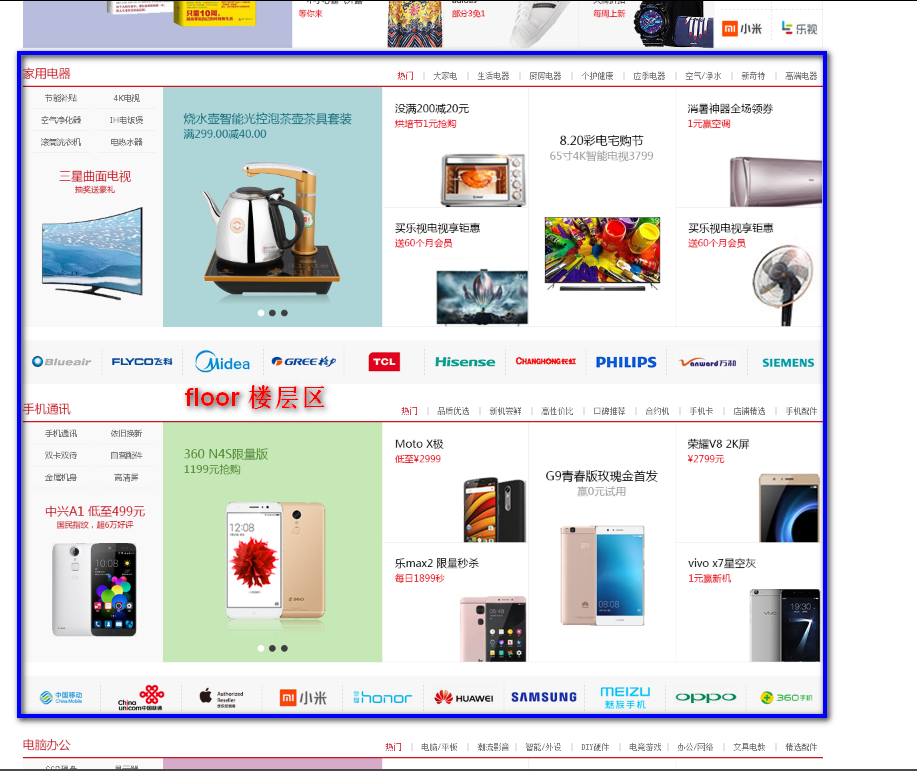
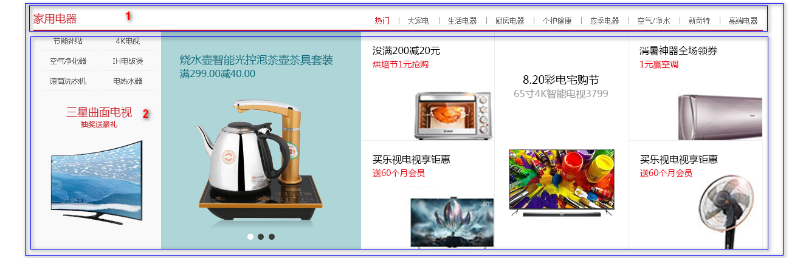
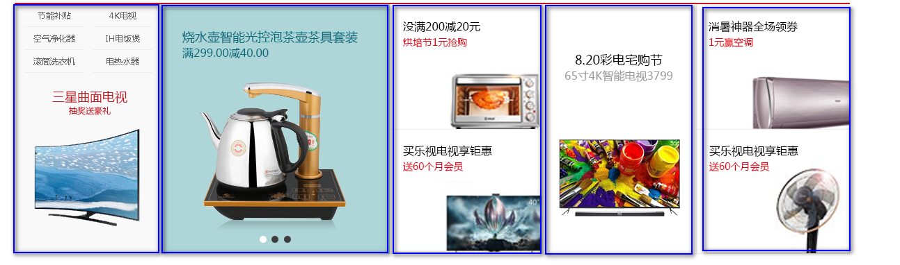
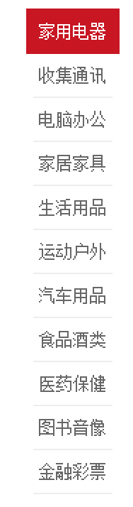
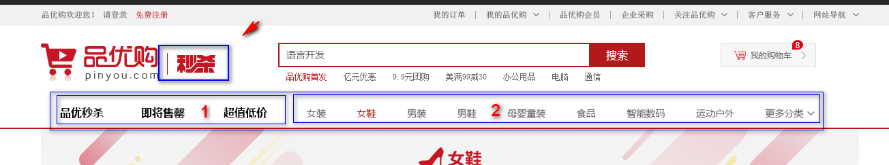
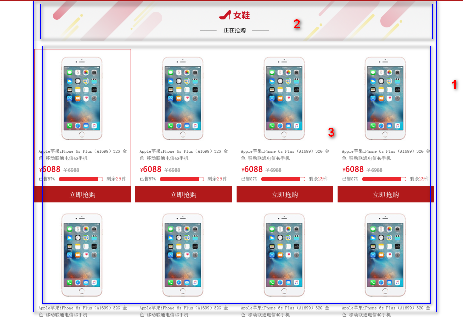
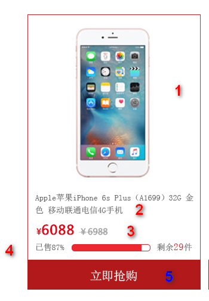
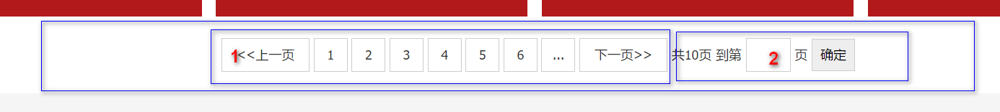

# 品优购项目(三)

## 1. 首页制作

### 1). 楼层区 floor

注意这个floor  一个大盒子 包含， 不要给高度，内容有多少，算多少



### 2). 家用电器模块



* 这个模块 jiadian 不需要写样式
* 版心居中对齐    因为这些模块  基本相同，下面的 模块基本用这些样式  所以 咱们下面两个盒子的命名是：
* 1号盒子  box-hd  给一个高度， 有个下边框      里面分为左右2个盒子
* 2号盒子  box-bd   不要给高度。

### 3). box-hd 模块

* 有高度


* 左边 h3  盒子     
* 右边 div   命名为 tab-list      因为用到 tab 切换效果， 所以 里面  要用 ul  和  li  来做 。

###  4). box-bd 模块



* 根据tab 切换的原理，  应该还需要一个 tab-content 的 内容来包装 里面的 5个 盒子
* 分为5个大列  列的宽度 不一致 

### 5). 侧边栏 fixedtool 制作

此模块用固定定位   里面包含  li   

 

### 6). 知识点 -过渡(CSS3)

过渡（transition)是CSS3中具有颠覆性的特征之一，我们可以在不使用 Flash 动画或 JavaScript 的情况下，当元素从一种样式变换为另一种样式时为元素添加效果。

过渡动画：   是从一个状态 渐渐的过渡到另外一个状态

可以让我们页面更好看，更动感十足，虽然 低版本浏览器不支持（ie9以下版本） 但是不会影响页面布局。

我们现在经常和 :hover 一起 搭配使用。

语法格式:

```
transition: 要过渡的属性  花费时间  运动曲线  何时开始;
```

| 属性                         | 描述                      | CSS  |
| -------------------------- | ----------------------- | ---- |
| transition                 | 简写属性，用于在一个属性中设置四个过渡属性。  | 3    |
| transition-property        | 规定应用过渡的 CSS 属性的名称。      | 3    |
| transition-duration        | 定义过渡效果花费的时间。默认是 0。      | 3    |
| transition-timing-function | 规定过渡效果的时间曲线。默认是 "ease"。 | 3    |
| transition-delay           | 规定过渡效果何时开始。默认是 0。       | 3    |

* 属性

​    属性就是你想要变化的 css 属性，  宽度高度 背景颜色 内外边距都可以 。如果想要所有的属性都变化过渡， 写一个all 就可以。

* 花费时间

  transition-duration  花费时间  单位是  秒（必须写单位）     s   ms      比如 0.5s    这个s单位必须写      ms 毫秒

* 运动曲线   默认是 ease

运动曲线示意图：


* 何时开始 

    默认是 0s  鼠标触发就立即开始    可以设置 延迟触发时间


**案例：**

```css
div {
			width: 200px;
			height: 100px;
			background-color: pink;
			/* transition: 要过渡的属性  花费时间  运动曲线  何时开始; */
			transition: width 0.6s ease 0s, height 0.3s ease-in 1s;
			/* transtion 过渡的意思  这句话写到div里面而不是 hover里面 */
  
			
}
div:hover {  /* 鼠标经过盒子，我们的宽度变为400 */

			width: 600px;
			height: 300px
}

transition: all 0.6s;  /* 所有属性都变化用all 就可以了  后面俩个属性可以省略 */
```

transition: all 0.5s;

常见效果：

  按钮变换底色     图片移动      小米效果 （阴影效果）   传智导航栏效果 等等


## 2. 列表页制作

### 1). 列表页准备工作

* 列表页面是新的页面，我们需要新建 list.html    

* 因为 列表页的 头部 和 底部 基本一致， 我们需要 把首页中的 头部  和 底部的  结构复制过去

* 头部和底部的 样式 ，列表也需要， 因此 list.html  也需要 引入   common.css  

* 同时 需要新的 list.css 文件   这个 样式文件，里面只写  list.html  结构里面的内容就好了

  ​

### 2). 列表页 header 和  nav 修改 



* 秒杀盒子 sk  定位 即可  second  kill 
* 1 号 盒子 左侧浮动  sk_list   里面包含 ul  和  li 
* 2 号盒子  左侧浮动   sk_con  里面 包含 ul  和  li

### 3). 列表页主体盒子 sk _container

这个盒子里面包含了 所有的 列表页的所有主体内容 

 

* 1号盒子  sk _container    给宽度 1200  不要给高度 
* 2号盒子  sk_hd   插入图片即可  
* 3号盒子   sk_bd  里面包含 很多的 ul 和  li 

### 4).  sk_goods  布局



* 此li 我们命名为 sk_goods  
* 1号位置   有 a 包含 本图片 和下面的 标题    插入 图片即可   seckill_mod_goods_img  可以做一个 鼠标放入 图片 上滑动的效果
* 2号位置  标题  H5  命名为  sk_goods_title  
* 3号 位置 为 价格 div  命名为  sk_goods_price    
* 4号位置  为  div  命名为  sk_goods_progress    此处，我们 采取 代码的形式 写出 这个 导航条
* 5号位置  为 a  链接   命名为  sk_goods_buy   此处注意， 因为父盒子已经有左右padding   我们这里用定位合适。

### 5). 分页制作 page



* 最大的盒子  我们div  命名为  page   注意里面的盒子 全部用 行内块 
* 1号盒子 用 span  命名为 page_num ( 页码的意思 )  里面 放 a      把a 转换为 行内块  设置样式 
  * pn_prev  上一页     pn_next  下一页
* 2号盒子 用 span 命名为  page_skip    ( skip 跳转 转移的意思 )    里面注意 有 input  和  button  

### 6). 知识点 -获得焦点元素

:focus 伪类 选择器用于选取获得焦点的元素 。 我们这里主要针对的是 表单元素

:hover 

语法：

~~~css

.total input {
  border: 1px solid #ccc;
  height: 30px;
  width: 40px;
  transition: all .5s;
}
/*这个input 获得了焦点*/
.total input:focus {
  width: 80px;
  border: 1px solid skyblue;
}
~~~

  border: 1px solid #ccc;
  height: 30px;
  width: 40px;
  transition: all .5s;
}
/*这个input 获得了焦点*/
.total input:focus {
  width: 80px;
  border: 1px solid skyblue;
}


