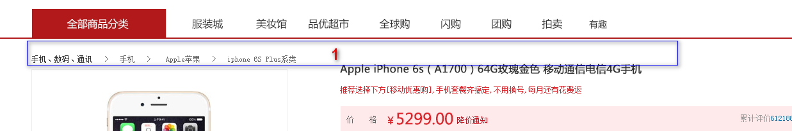
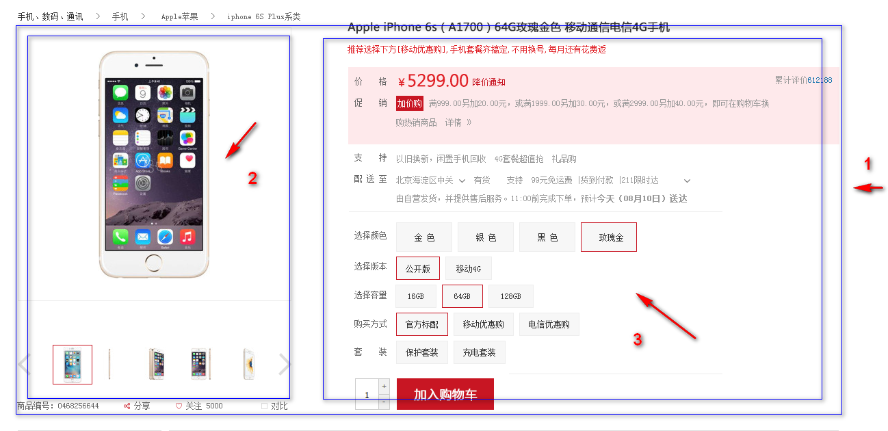
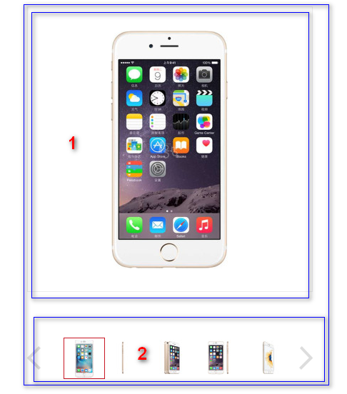
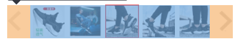
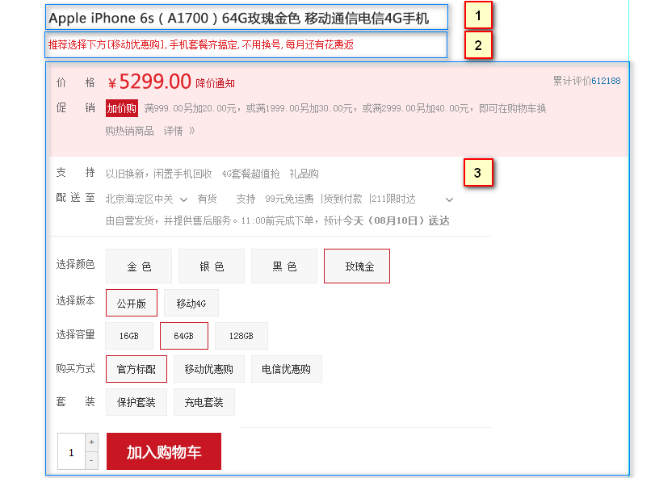
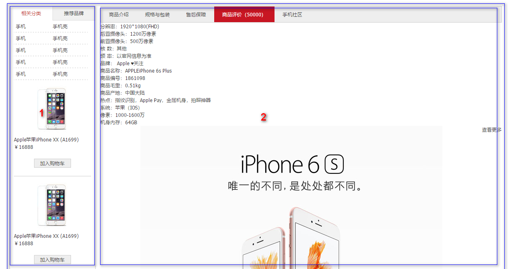
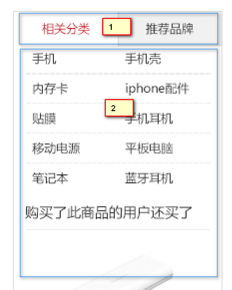
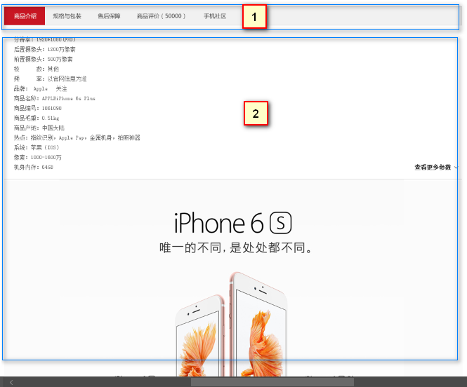
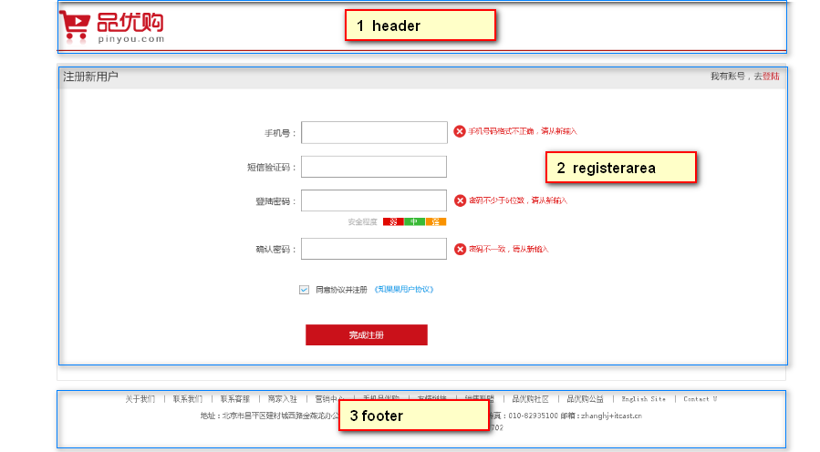
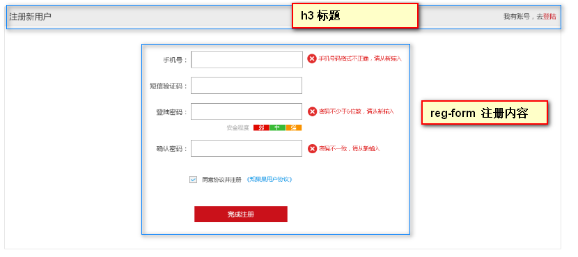

# 1. 品优购项目(四)

## 1). 详情页 detail.html  常用单词

| 名称             | 说明                                  |
| ---------------- | ------------------------------------- |
| 主体             | de_container                          |
| 面包屑导航       | crumb_wrap                            |
| 产品介绍         | product_intro   （ introduction介绍） |
| 预览包           | preview_wrap（左侧部分）              |
| 预览缩略图       | preview_img                           |
| 预览列表         | preview_list                          |
| 左按钮           | arrow_prev                            |
| 右按钮           | arrow_next                            |
| 小图列表         | preview_items                         |
| 产品详细信息区域 | itemInfo_wrap （右侧部分）            |
| 头部名称         | sku_name       skull  头骨            |
| 新闻             | news                                  |
| 摘要             | summary                               |
| 评价             | remark                                |
| 价格摘要         | summary_price                         |
| 配送至           | summary_stock                         |
| 支持             | summary_support                       |
| 选择             | choose                                |
| 选择按钮组       | choose_btns                           |
| 选择数量         | choose_amount                         |
| 减去             | reduce                                |
| 加入购物车       | addshopcar                            |
| 产品细节         | product_detail      （   detail描述） |
| 左侧边           | aside                                 |
| 详细描述         | detail                                |

## 2). 面包屑导航 

* crumb_wrap   面包屑导航
* 关于面包屑导航的由来是源于一则童话故事的一个词语：汉泽尔和格蕾特尔两个人在穿过森林是，为了避免找不到回家的路，他们在沿途走过的地方都会撒下面包屑以便于根据这些面包屑找到回家的路。

## 3). 产品介绍 模块

* 1号盒子 本模块 命名为产品模块   product_intro   （ introduction介绍）
* 此模块不要给高度  因为右侧的模块内容高度不固定
* 里面有2个盒子  分为是2号盒子 和  3号盒子  
* 2号盒子为  预览区域  preview_wrap   给宽度，给高度， 左浮动
* 3号盒子为  产品详细信息区域  itemInfo_wrap 给宽度 ，不要给高度  左侧浮动 

## 4).  预览区域制作

* 1号盒子 为  图片预览   命名为   preview_img    注意里面的图片，我们切图的时候是 398*398 像素的
* 2号盒子 为 预览列表   命名为  preview_list

### 3.1 preview_list 制作

*  盒子 有左右按钮   arrow_prev   arrow_next  用定位即可 
* 中间 用 ul  命名为    list-item    给宽度和高度 然后  margin: 0 auto;  水平居中对齐即可

## 5). 产品详细信息区域制作 itemInfo_wrap 

* 此盒子命名为 itemInfo

* 1 号盒子 为 头部 sku_name    

* 2 号盒子 为 最新新闻  news  

* 3号盒子 为  产品详细摘要  我们命名为  summary （摘要的意思）   之所以下面都是摘要部分，因为里面格式基本相同。

* 下面为详细命名

  | 名称       | 说明                                      |
  | ---------- | ----------------------------------------- |
  | 头部名称   | sku_name       skull  头骨                |
  | 新闻       | news                                      |
  | 摘要       | summary                                   |
  | 评价       | remark                                    |
  | 价格摘要   | summary_price                             |
  | 促销摘要   | summary_promotion                         |
  | 配送至     | summary_stock                             |
  | 支持       | summary_support                           |
  | 选择       | choose                                    |
  | 选择版本  | choose_version                 |
  | 选择类型   | choose_type                       |
  | 选择按钮组   | choose_btns                             |
  | 选择数量   | choose_amount        add 是加的意思          |
  | 减去       | reduce     cursor: not-allowed;  禁止符号 |
  | 加入购物车 | addshopcar                                |

## 6).  产品细节模块 product_detail 

* 大盒子为 product_detail 模块 不要给高度 ，别忘记清除浮动
* 1号盒子 左侧浮动 命名为 aside  有宽度 不给高度
* 2号盒子 右侧浮动  命名为 detail   有宽度不给高度

### 6.1) aside 布局

* 1 号盒子 命名为 tab_list   给高度就好了 ，里面 放 ul 和 li   注意这是 tab栏切换布局
* 2 号盒子  命名为  tab_con    里面还包含 很多个ul.item 和 上面的 tab_list 里面的li一一对应。   

### 6.2) detail 布局

- 1 号盒子 命名为 detail_tab_list   给高度就好了 ，里面 放 ul 和 li   注意这是 tab栏切换布局
- 2 号盒子  命名为  detail_tab_con    里面还包含 很多个ul.item 和 上面的 tab_list 里面的li一一对应。   

## 7. 注册页面 register

注册页面

| 名称   | 说明           |
| ---- | ------------ |
| 注册专区 | registerarea |
| 注册内容 | reg-form     |
| 错误的  | error        |
| 成功的  | success      |
| 默认的  | default      |

### 7.1 registerarea布局

# 2. 课程总结

1. html 我们学的就是常用标签， 就是基本盒子
2. css 就是用来美化布局网页。
3. html+css 是没有逻辑可言的，基本就是搭积木摆放盒子的过程，你需要的是耐心。
4. 对同学们来说，现在最困难的是 布局结构 。欠缺分析页面布局的能力
5. 多看别人写的页面，模仿人家的布局，每次写页面总会有新的收获。
6. 错误总是在所难免，一定要学会利用chrome 调试工具， 他们能快速帮我们排查错误。你还需要细心。
7. 学好定位，对后面学习JavaScript 有很大的帮助。
8. 后面的课程会更精彩，尽情期待。。。
9. 记住我们的口号：  拼死也要克服它 （pink ）